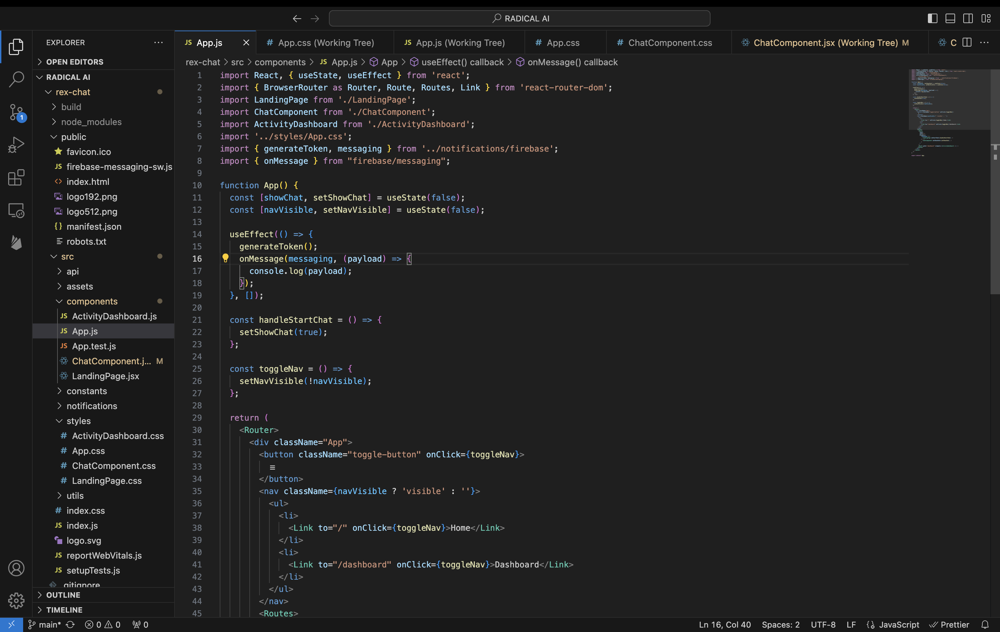
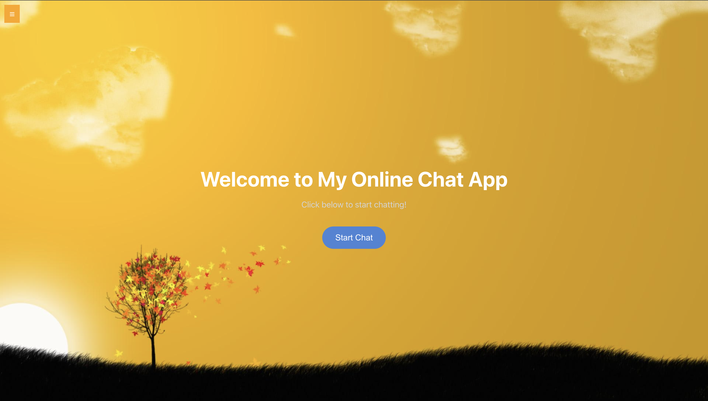
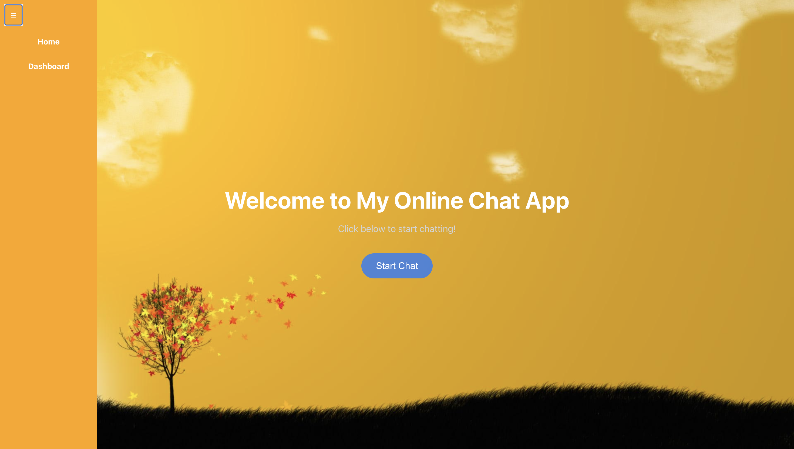
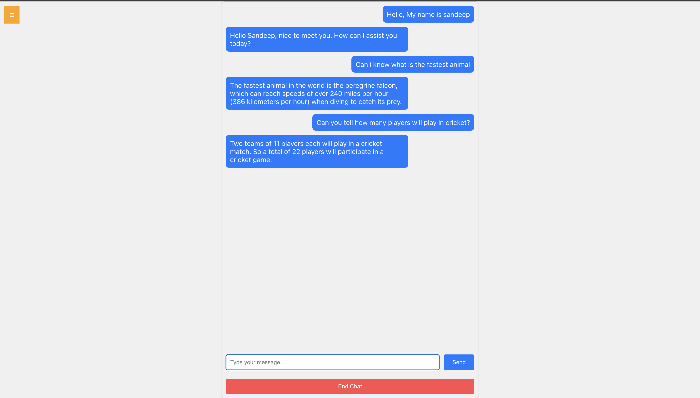
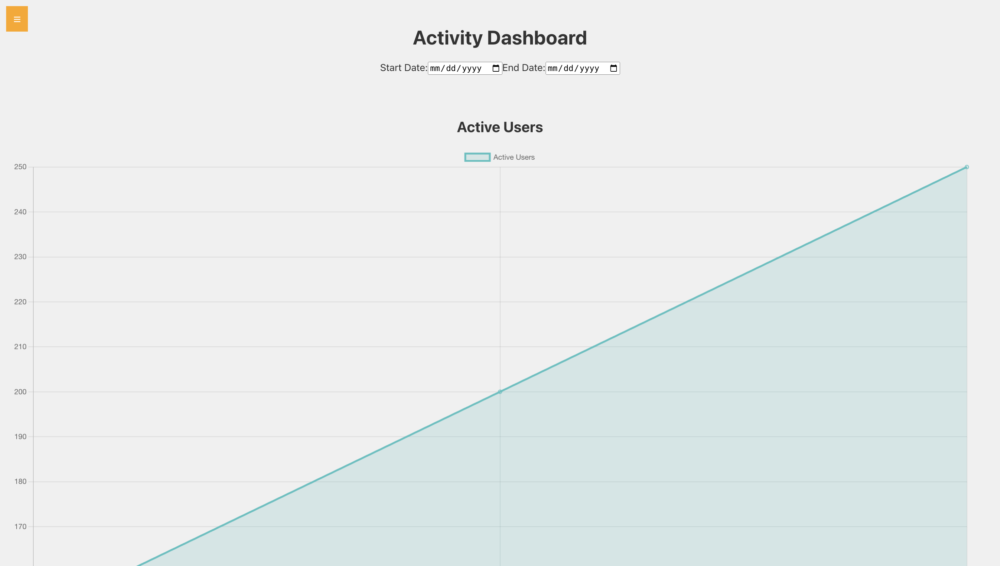
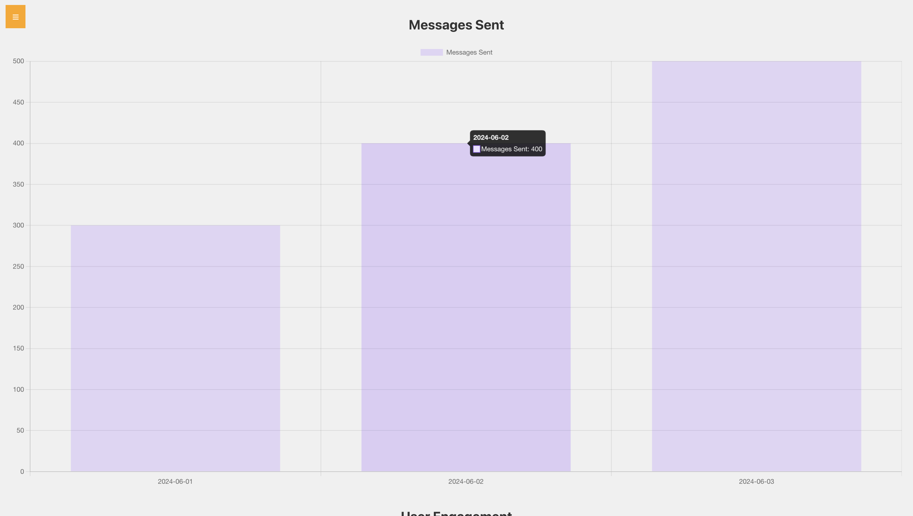
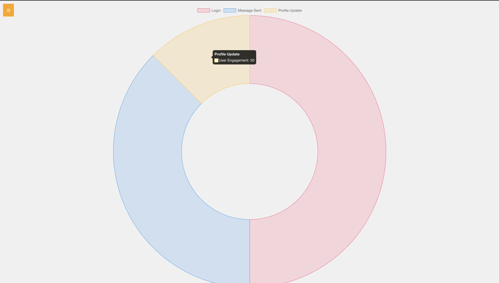

#CosmoChat UI

Welcome to CosmoChat UI, a React-based web application integrated with Firebase for real-time communication and activity tracking. I have developed this project as part of my internship in Radical AI.

Features : 
* Real-time Chat: Engage in instant messaging with the ChatComponent, managed via React's state hooks for seamless user interaction.
* Firebase Notifications: Utilizes Firebase Cloud Messaging (FCM) for personalized, real-time notifications, ensuring timely updates.
* User Interface: Features a responsive navigation bar and interactive ActivityDashboard with react-chartjs-2 for visual data representation.

Challenges & Solutions :
Addressed integration challenges with Firebase Cloud Messaging by configuring service workers and managing browser permissions.

Conclusion : 
CosmoChat UI showcases the synergy of React and Firebase, enhancing user communication and activity tracking through modern web technologies.

Screenshots :

For executing the project download it and run it by using npm start.